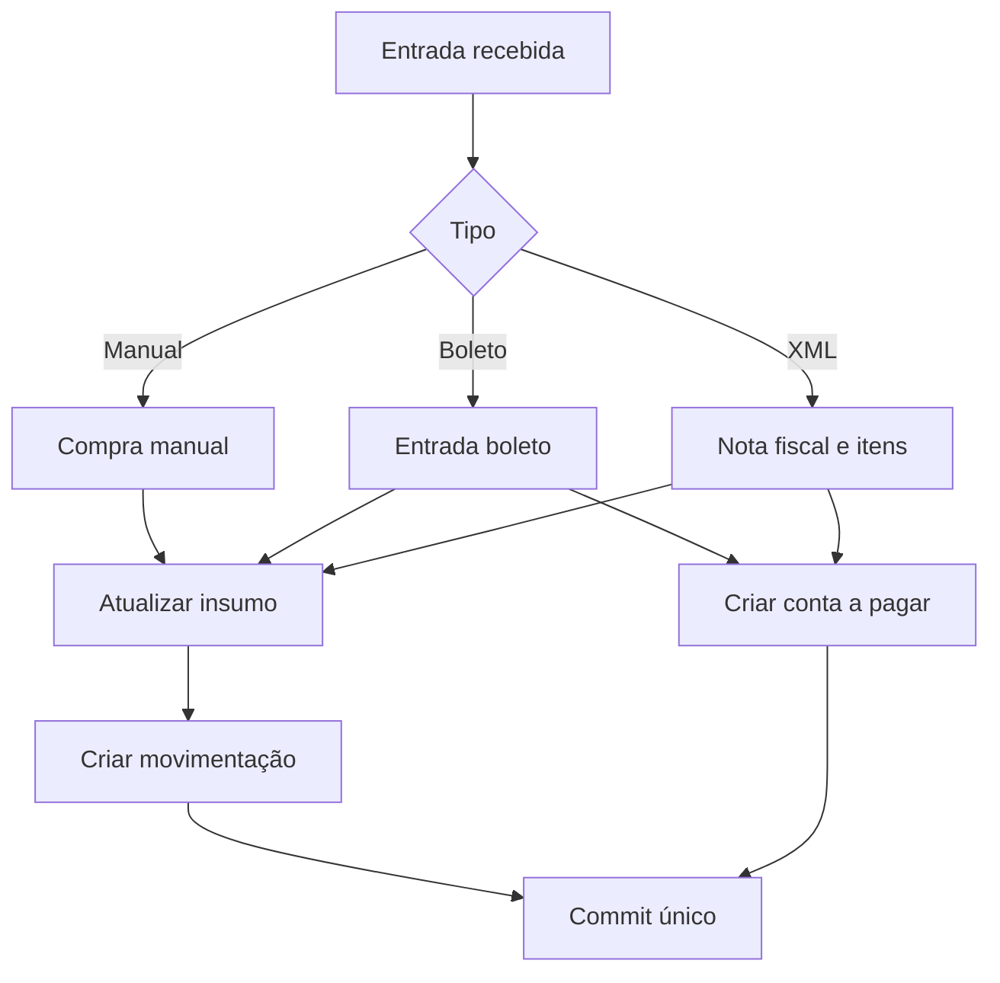

# Arquitetura do Imperial ERP

## Decisões principais

- **Monorepo npm workspaces**: mantém frontend e API versionados juntos, sem impedir separação futura.
- **NestJS por domínios**: `auth`, `estoque`, `compras` e `financeiro` têm controllers e services próprios.
- **Prisma + PostgreSQL**: consistência relacional e transações para a regra de ouro do negócio.
- **Valores monetários em Decimal**: evita erros de arredondamento de ponto flutuante.
- **Estoque por movimentação**: toda alteração de saldo gera um registro imutável com referência à origem.
- **Idempotência de NF-e**: a chave de acesso é única e impede dupla entrada da mesma nota.
- **RBAC**: Administrador, Gerente, Cozinha, Compras, Financeiro e Estoque.

## Fluxo transacional de compras

Tudo dentro do contorno lógico acima roda em uma única transação. Erros de validação, insumo inexistente ou chave de NF-e duplicada cancelam o conjunto.

## Entidades modeladas

| Área | Entidades |
| --- | --- |
| Segurança | `Usuario`, `RefreshToken` |
| Estoque | `Insumo`, `Movimentacao` |
| Compras | `Fornecedor`, `PedidoCompra`, `PedidoCompraItem`, `Cotacao`, `CotacaoFornecedor`, `CompraManual`, `EntradaBoleto`, `NotaFiscalXml`, `NotaFiscalItem` |
| Cozinha | `OrdemPreparo` |
| Vendas | `Pedido`, `PedidoItem` |
| Financeiro | `ContaPagar`, `ContaReceber` |

## Próxima evolução recomendada

1. Separar produtos acabados, receitas e ficha técnica para baixa automática de insumos.
2. Implementar pedidos e fornecedores completos no backend.
3. Adicionar testes de integração com PostgreSQL efêmero.
4. Migrar o parser de NF-e também para o servidor, validando assinatura e CNPJ.
5. Adicionar auditoria por usuário, filial e tenant.
6. Integrar iFood/Rappi por adaptadores e fila assíncrona.
7. Adicionar relatórios PDF/Excel e observabilidade.
